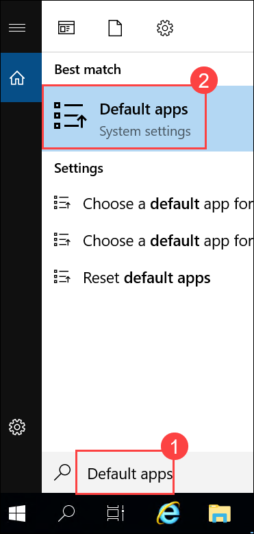
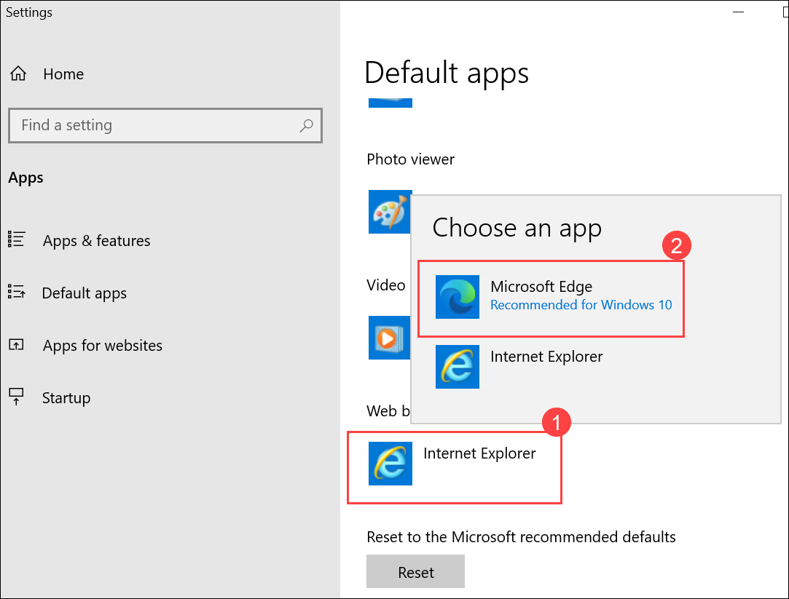
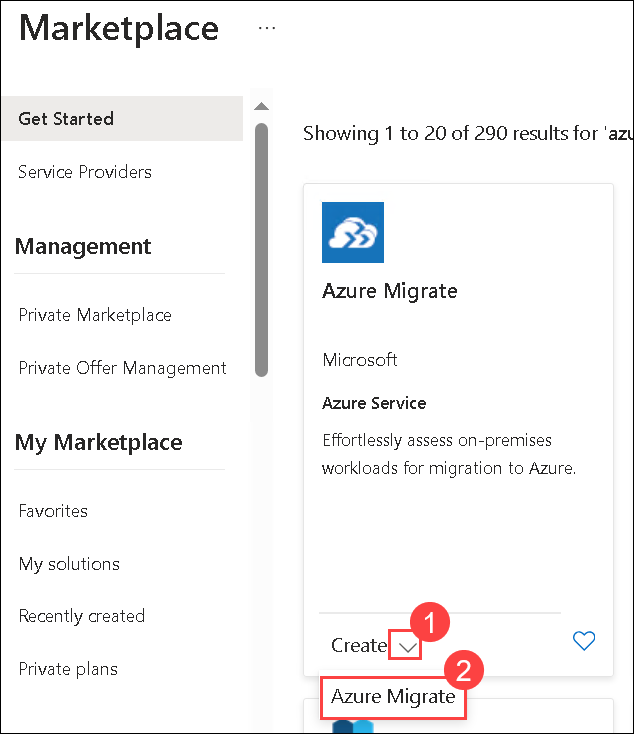
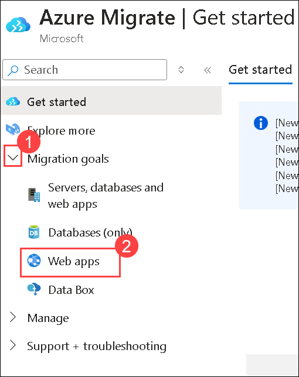
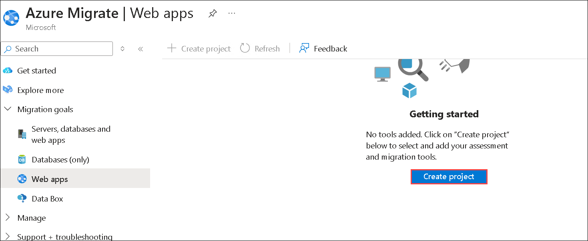
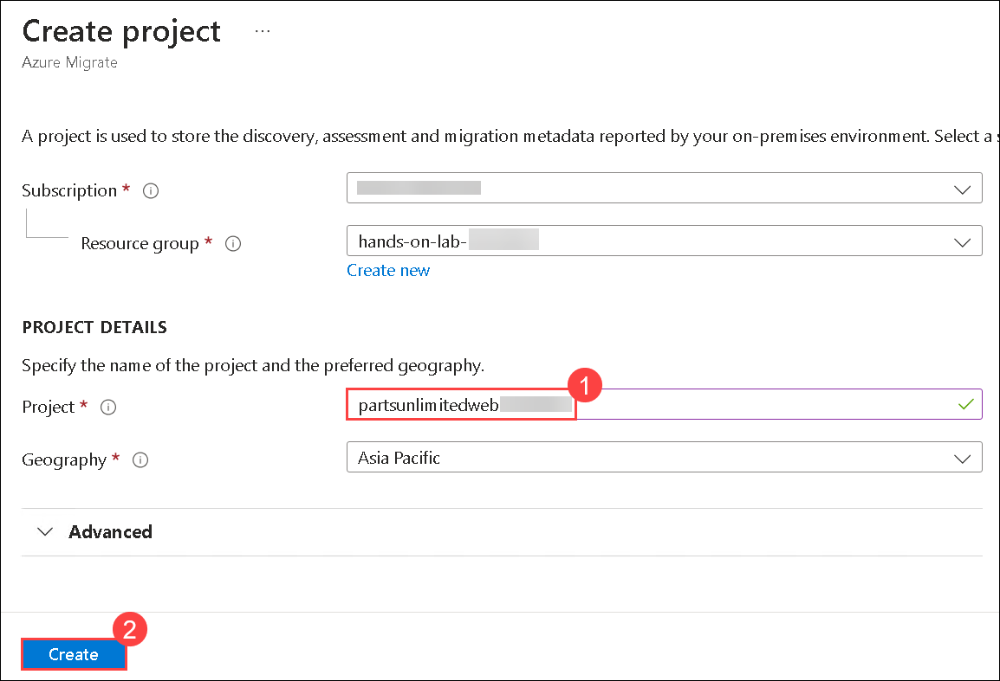
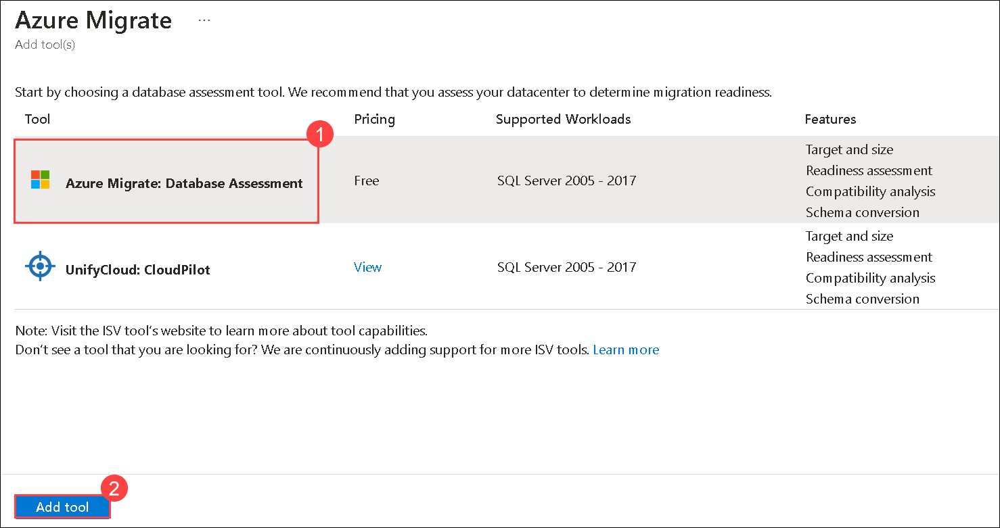
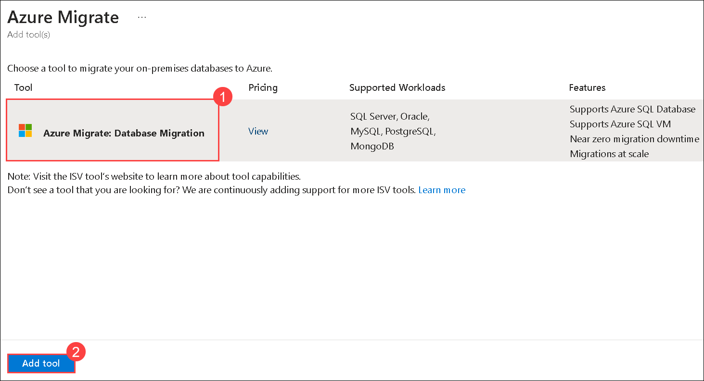

# Exercise 2: Setting up Azure Migrate for App Migration

### Estimated Duration: 15 minutes

## Overview

Azure Migrate provides a centralized hub to assess and migrate on-premises servers, infrastructure, applications, and data to Azure. It provides a single portal to start, run, and track your migration to Azure. Azure Migrate comes with a range of tools for assessment and migration that we will use during our lab. We will use Azure Migrate as the central location for our assessment and migration efforts.

## Lab objectives

You will be able to complete the following tasks:

- Task 1: Setting up Azure Migrate for App Migration

## Task 1: Setting up Azure Migrate for App Migration

In this task, you will configure Azure Migrate to assess the readiness of the application and database for migration to Azure services.

1. From the Windows search bar, search for **Default apps (1)** and select **Default apps (2)** from the results.

   
   
2. On the **Default apps** Blade, click on **Internet Explorer (1)** and select **Microsoft Edge (2)** for setting Microsoft Edge as the default browser.

   
   
3. Open the **Azure portal** from the shortcut and log in to Azure. When prompted, use the below credentials to complete the login process.

    * Email/Username: <inject key="AzureAdUserEmail"></inject>
    * Password: <inject key="AzureAdUserPassword"></inject>

      

4. Select your **resource group**. 

    

5. Select **+ Create** inside the resource group to add a new resource.
    
    

6. Type **Azure Migrate (1)** into the search box and select **Azure Migrate (2)** from the dropdown.

    

7. Select **Create (1)** and click on **Azure Migrate (2)** to continue.

    

8. As part of our migration project for Parts Unlimited, we will first assess and migrate their Web Application living on IIS, on a VM. Select **Web Apps (2)** under **Migration goals (1)** to continue.

    

9. Select **Create project**. You may have to scroll down to see the Create Project option.

    

10. Type **partsunlimitedweb<inject key="DeploymentID" enableCopy="false"/> (1)**  as your project name. Select **Create (2)** to continue. 

    

11. Once your project is created, **Azure Migrate** will show you the default **Web App Assessment (1)** and **Web App Migration (2)** tools (You might need to refresh your browser). For the Parts Unlimited website, **App Service Migration Assistant** is the one we need to use. Download links are present on Azure Migrate's Web Apps page. In our case, our lab environment comes with App Service Migration Assistant pre-installed on Parts Unlimited's web server.

    

12. Another aspect of our migration project will be the database for Parts Unlimited's website. We will have to assess the database's compatibility and migrate to Azure SQL Database. Let's switch to the **Databases (only) (1)** section in Azure Migrate. Select **Click here (2)** hyperlink for Assessment tools.

    

13. We will use **Azure Migrate: Database Assessment** to assess Parts Unlimited's database hosted on a SQL Server 2008 R2 server. Pick **Azure Migrate: Database Assessment (1)** and select **Add tool (2)**.

    

14. Now, we can see a download link for the **Data Migration Assessment (1)** tool under assessment tools in Azure Migrate. In our case, our lab environment comes with the Data Migration Assessment pre-installed on Parts Unlimited's database server. Select **Click here (2)** under the **Migration Tools** section to continue.

    

15. We will use **Azure Migrate: Database Migration** to migrate Parts Unlimited's database to an Azure SQL Database. Pick **Azure Migrate: Database Migration (1)** and select **Add tool (2)**.

    

16. Under the Azure Migrate umbrella, we now have all of the necessary assessment and migration tools ready for Parts Unlimited.

    

> **Congratulations** on completing the task! Now, it's time to validate it. Here are the steps:	
  - Hit the Validate button for the corresponding task. If you receive a success message, you can proceed to the next task. 
  - If not, carefully read the error message and retry the step, following the instructions in the lab guide.
  - If you need any assistance, please contact us at cloudlabs-support@spektrasystems.com. We are available 24/7 to help you out.

<validation step="4c898343-5674-40c4-953f-cfd52c87e7de" />
    

## Summary
 
In this exercise you have covered the following:

- Setup Azure Migrate to assess and migrate on-premises servers, infrastructure, applications, and data to Azure.

### You have successfully completed the Exercise

**Click Next to proceed to the Next exercise**
