# Exercise 4: Migrate your application with App Service Migration Assistant
 
### Estimated Duration: 20 minutes

## Overview

App Service Migration Assistant is a tool designed to assess and migrate web applications to Azure App Service. You will explore how the tool identifies compatibility issues, provides remediation recommendations, and facilitates the migration of the web application to Azure’s platform-as-a-service (PaaS) environment.

## Lab objectives

You will be able to complete the following tasks:

- Task 1: Migrate the web application to Azure App Service

- Task 2: Configure the application connection to SQL Azure Database

## Task 1: Migrate the web application to Azure App Service

In this task, after reviewing the assessment results, you have ensured the web application is a good candidate for migration to Azure App Service. Now, we will continue migrating the application.

1. Navigate back to the **App Service Migration Assistant** window from the background. You can click from the bottom menu as well.

    

1. In order to continue with the migration of our website, Azure App Service Migration Assistant needs access to our Azure Subscription. Select **Copy Code & Open Browser** button to be redirected to the Azure Portal.

   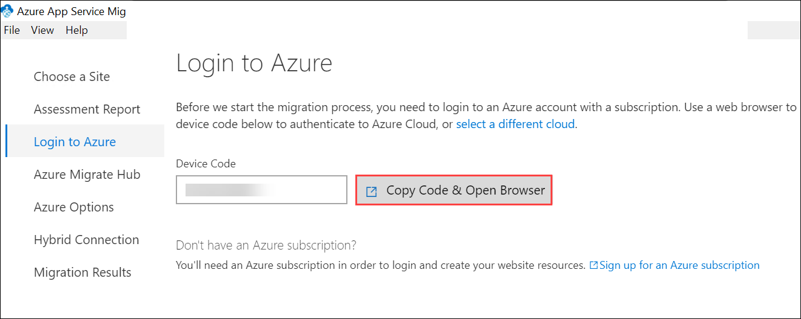

1. A new tab opens to the login page within the Edge browser. Paste your Device code **(1)**. Select **Next (2)** to give subscription access to App Service Migration Assistant.

    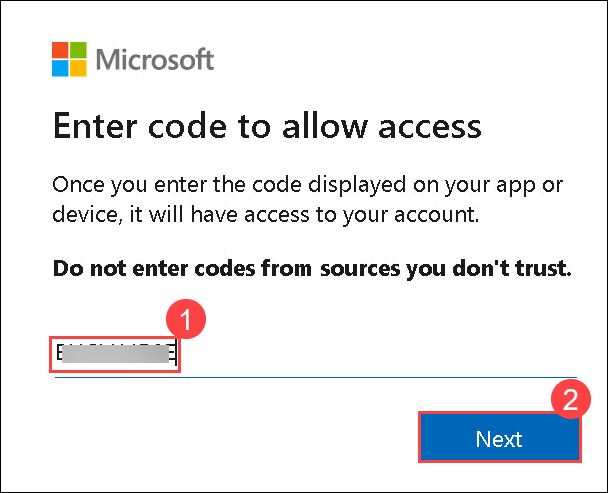

1. Continue the login process with your Azure Subscription credentials.

1. Click on **Continue**.

    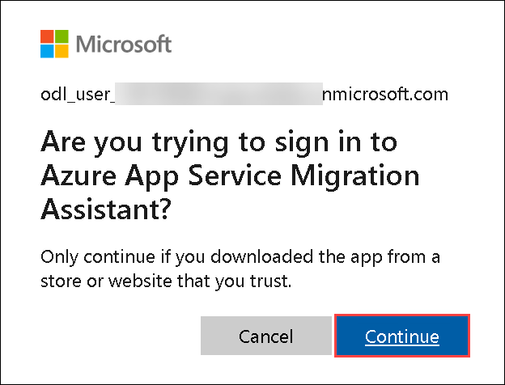

1. When you see the message that says **You have signed in to the Azure App Service Migration Assistant application on your device**, close the browser tab and minimize the Edge browser window to return to the App Service Migration Assistant Window.    

    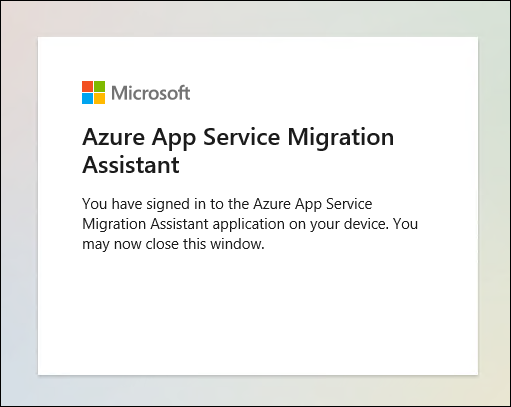

1. Navigate to the **App Service Migration Assistant** window, select the Azure Migrate project we created **(1)** in the previous exercise to submit the results of our migration. Select **Next (2)** to continue.

    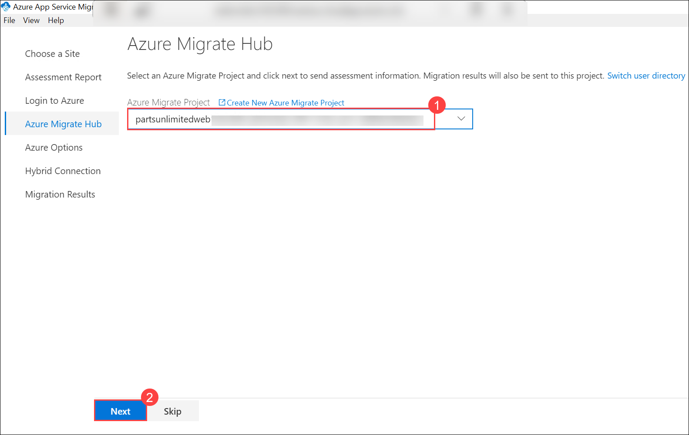

1. In order to migrate the Parts Unlimited website, we have to create an App Service Plan. The Azure App Service Migration Assistant will take care of all the requirements needed.

    - **Hybrid Connection**: Select **Use existing (1)** 
    - **Migration Results**: select the resource group **hands-on-lab-<inject key="DeploymentID" enableCopy="false"/>** **(2)**
    - **Destination Site Name**: Enter **partsunlimited-web-<inject key="DeploymentID" enableCopy="false"/>** **(3)**.
    - **Region**: Select the **<inject key="location" style="color:red" />** **(4)**. 
    - Click **Migrate** **(5)** to start the migration process.

      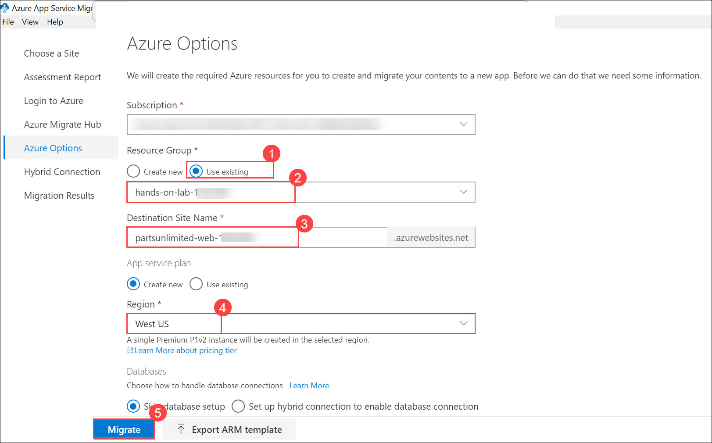

      > **WARNING:** If your migration fails with a **WindowsWorkersNotAllowedInLinuxResourceGroup (1)** It may be due to the incorrect region. Try the migration process again, but this time select the correct region.  
      >
      > 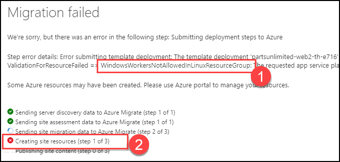

1. We have just completed the migration of the Parts Unlimited website from IIS into a Virtual Machine to Azure App Service. Congratulations. Let's go back to the Azure Portal and look into Azure Migrate. Search for **Migrate (1)** on the Azure Portal and select **Azure Migrate (2)**.

    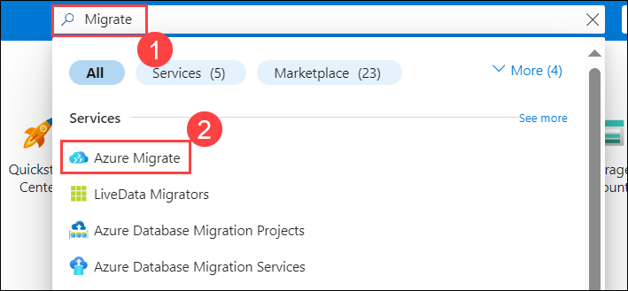

1. Switch to the **Web apps (1)** section. See the number of discovered web servers, assessed websites **(2)** and migrated websites change **(3)**. Keep in mind that you might need to wait for 5 to 10 minutes for the results to show up. You can use the **Refresh** button on the page to see the latest status.

    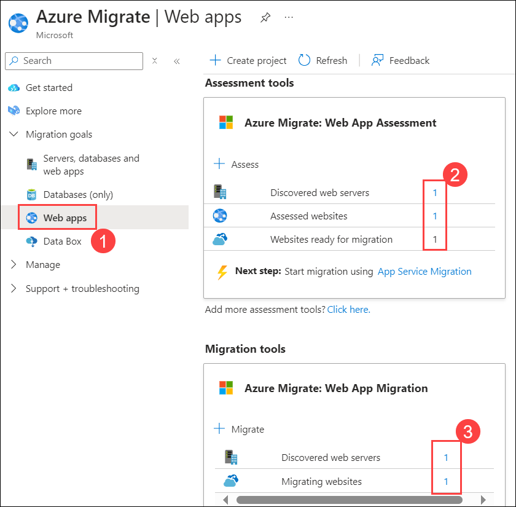

## Task 2: Configure the application connection to SQL Azure Database

Now that we have both our application and database migrated to Azure. It is time to configure our application to use the SQL Azure Database.

1. In the Azure portal, navigate to your `parts` SQL Database resource by selecting the **hands-on-lab-<inject key="DeploymentID" enableCopy="false"/>** resource group, and selecting the `parts` SQL Database from the list of resources.

   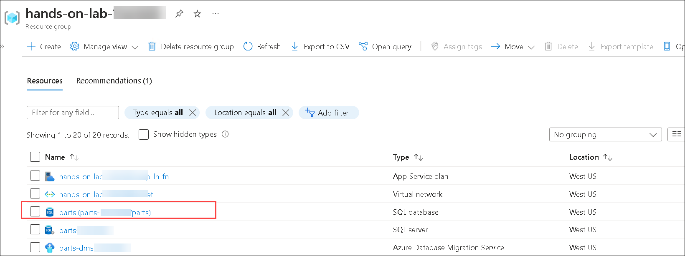

1. Switch to the **Connection strings (1)** Blade, and copy the connection string under **ADO.NET(SQL authentication)** by selecting the copy button **(2)**.

   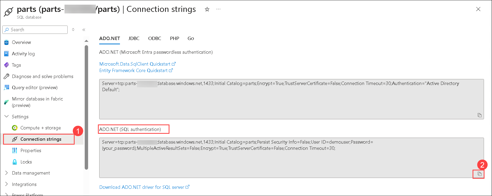

1. Paste the value into a text editor, such as Notepad.exe, to replace the Password placeholder. Replace the `{your_password}` section with **<inject key="SQLVM Password" />**. Copy the full connection string with the replaced password for later use.

    

1. Go back to the resource list, search for `partsunlimited-web` **(1)** to find your Web App and App Service Plan. Select to your **partsunlimited-web-<inject key="DeploymentID" enableCopy="false"/> (2)** App Service resource.

   

1. Switch to the **Environment variables (1)** Blade, and select **connection string (2)** then click on **+Add (3)**.

    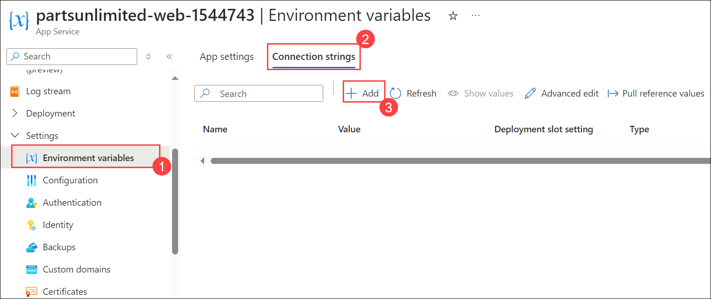

1. On the **Add/Edit connection string** panel, enter the following:

   - **Name (1)**: Enter `DefaultConnectionString` **(1)**
   - **Value (2)**: Enter SQL Connection String you copied in Step 3. **(2)**
   - **Type (3)**: Select **SQLAzure (3)**
   - **Deployment slot setting (4)**: Check this option to make sure connection strings stick to a deployment slot. This will be helpful when we add additional deployment slots during the next exercises.
   - Select **Apply (5)**.

     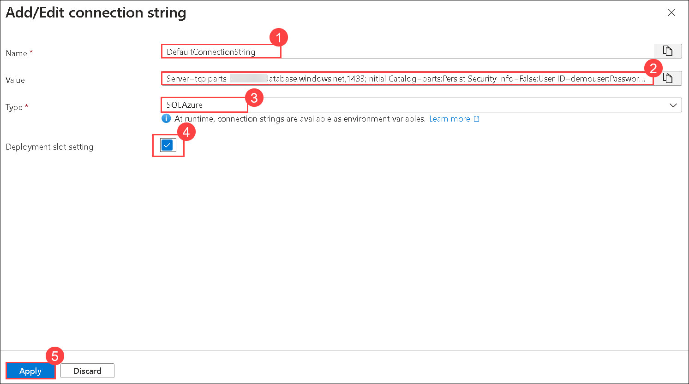

1. Select **Apply (1)** and **Confirm (2)** for the following Save changes dialog.

   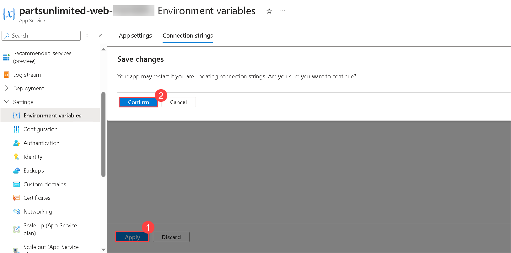

1. Switch to the **Overview (1)** Blade, and select **Default domain (2)** to navigate to the Parts Unlimited web site hosted in our Azure App Service using Azure SQL Database.

    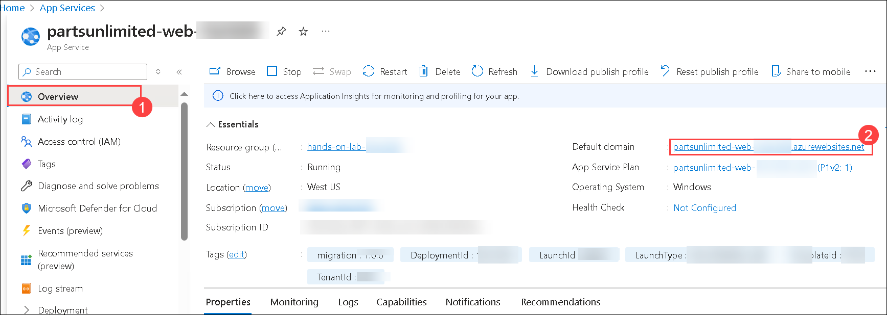
    
1. You will be navigated to a web page which we have migrated to App Service

    
   
> **Congratulations** on completing the task! Now, it's time to validate it. Here are the steps:
  - Hit the Validate button for the corresponding task. If you receive a success message, you can proceed to the next task. 
  - If not, carefully read the error message and retry the step, following the instructions in the lab guide.
  - If you need any assistance, please contact us at cloudlabs-support@spektrasystems.com. We are available 24/7 to help you out.

<validation step="83075887-7dea-4a4f-882d-e3256324d2ea" />

## Summary

In this exercise you have covered the following:
 
 - Migrated the on-prem web application to Azure using App Service Migration Assistant. 

## Conclusion

By completing these exercises, you have successfully assessed and migrated the on-premises application and database to Azure. The application is now hosted on Azure App Service, benefiting from enhanced performance, scalability, and simplified management.

### You have successfully completed the Lab
