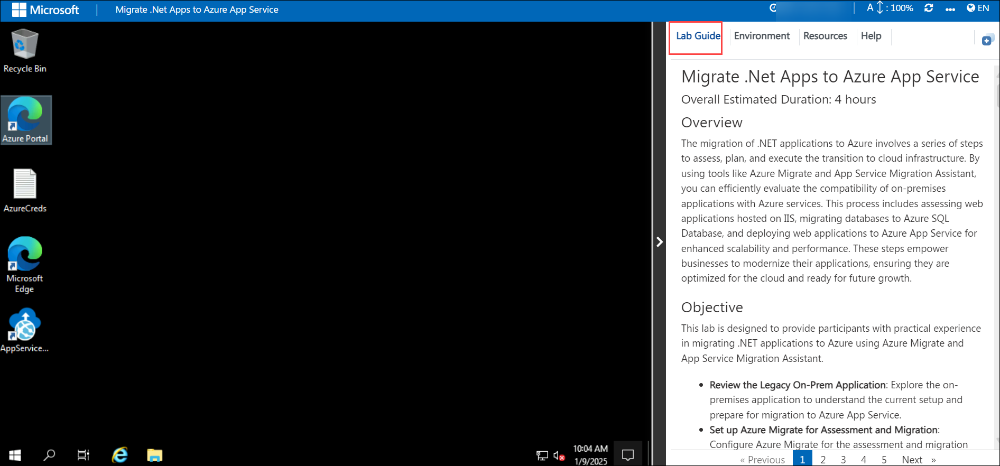
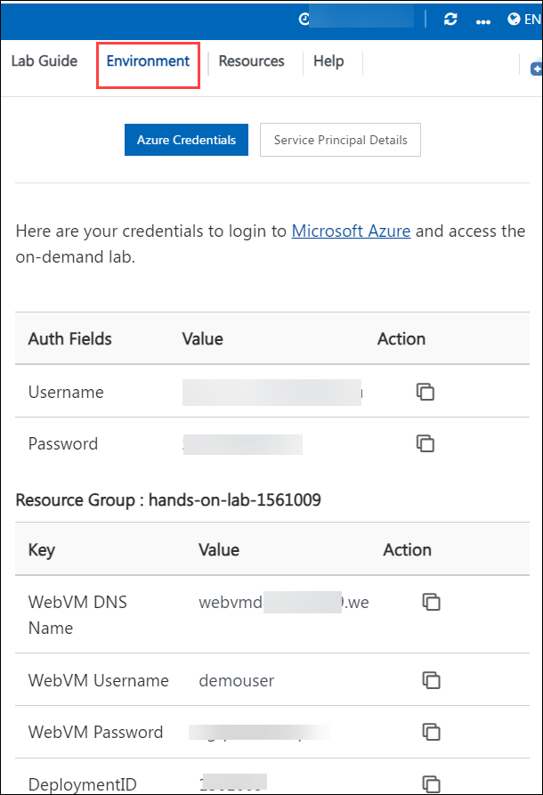
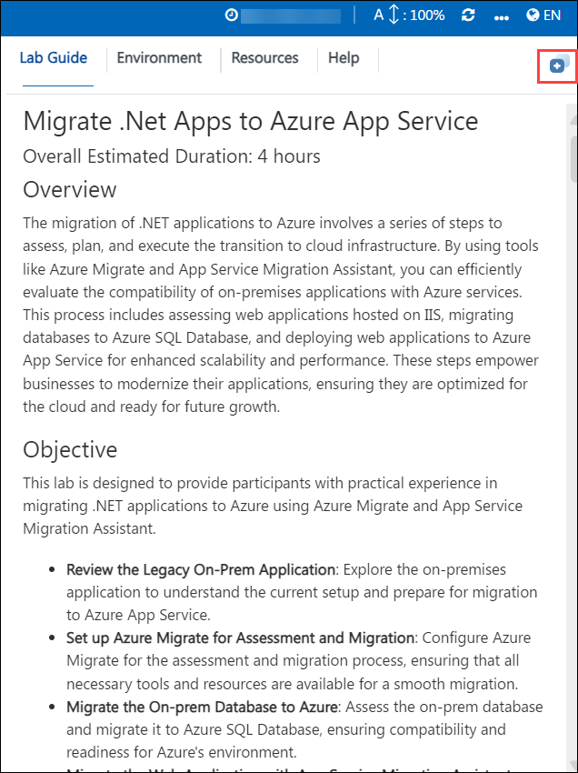
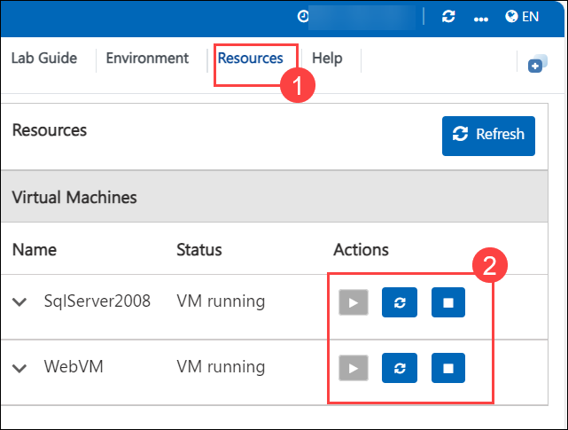
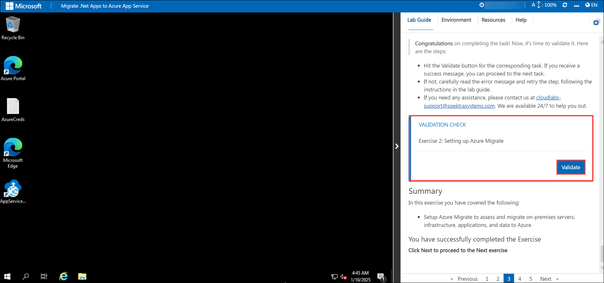

# Migrate .Net Apps to Azure App Service

### Overall Estimated Duration: 4 hours

## Overview

The migration of .NET applications to Azure involves a series of steps to assess, plan, and execute the transition to cloud infrastructure. By using tools like Azure Migrate and App Service Migration Assistant, you can efficiently evaluate the compatibility of on-premises applications with Azure services. This process includes assessing web applications hosted on IIS, migrating databases to Azure SQL Database, and deploying web applications to Azure App Service for enhanced scalability and performance. These steps empower businesses to modernize their applications, ensuring they are optimized for the cloud and ready for future growth.

## Objective

This lab is designed to provide participants with practical experience in migrating .NET applications to Azure using Azure Migrate and App Service Migration Assistant.

- **Review the Legacy On-Prem Application**: Explore the on-premises application to understand the current setup and prepare for migration to Azure App Service.
- **Set up Azure Migrate for Assessment and Migration**: Configure Azure Migrate for the assessment and migration process, ensuring that all necessary tools and resources are available for a smooth migration.
- **Migrate the On-prem Database to Azure**: Assess the on-prem database and migrate it to Azure SQL Database, ensuring compatibility and readiness for Azure's environment.
- **Migrate the Web Application with App Service Migration Assistant**: Perform the assessment of the web application and migrate it to Azure App Service, ensuring readiness and compatibility with Azure’s environment.

## Prerequisites

Participants should have the following prerequisites:

- **Basic understanding of cloud computing concepts**: Familiarity with cloud environments, particularly Azure, will help in navigating and understanding the migration process.

- **Familiarity with .NET applications**: Understanding the structure and functioning of .NET web applications, particularly those running on IIS and using SQL databases.

- **Azure account with required permissions**: Participants need an Azure subscription with permissions to create and manage resources like App Services, Virtual Machines, and Resource Groups.

- **Basic knowledge of using Azure portal**: Comfort with the Azure portal interface, including creating and managing resources, navigating to various services, and configuring settings.

- **Access to virtual machines running on Azure**: Access to the WebVM and SQLVM for the assessment and migration process.

## Architechture

The architecture for migrating .NET applications to Azure involves using **Azure Migrate** to assess on-premises applications and databases for migration. The **App Service Migration Assistant** evaluates the compatibility of the web application with **Azure App Service**, a fully managed platform for web app hosting. The application is then migrated to **Azure App Service**, and a corresponding **App Service Plan** defines the resources and scaling options for the hosted app. The application’s backend database is migrated to **Azure SQL Database**, providing a managed, scalable solution for data storage. All resources are organized within an **Azure Resource Group** to ensure efficient management and deployment. This architecture enables seamless migration, scalability, and management of web applications in the cloud.

## Architechture Diagram

## Explanation of Components

The architecture for this lab involves several key components:

- **Azure Migrate**: A tool for assessing and migrating on-premises workloads to Azure, including applications and databases.

- **App Service Migration Assistant**: A tool to assess the compatibility of on-premises .NET applications with Azure App Service.

- **App Service Plan**: A resource in Azure that defines the region, capacity, and features of an Azure App Service. It’s used to host web apps and provides the compute resources required for your application.

- **Azure App Service**: A fully managed platform to build, deploy, and scale web apps.

- **Resource Group**: A container in Azure for organizing and managing resources like App Service and databases.

- **Virtual Machine (WebVM & SQLVM)**: VMs hosting the web application and SQL Server database for assessment and migration.

- **Azure SQL Database**: A managed database service in Azure for hosting the application's backend database post-migration.

## Getting Started with Lab

Welcome to your Migrate .NET Apps to Azure App Service Lab! We've prepared a comprehensive environment for you to assess, migrate, and optimize .NET applications to Azure. Let’s begin and make the most of this experience:

## Accessing Your Lab Environment
 
Once you're ready to dive in, your virtual machine and **Lab Guide** will be right at your fingertips within your web browser.

     

## Utilizing the Zoom In/Out Feature

To adjust the zoom level for the environment page, click the **A↕ : 100%** icon located next to the timer in the lab environment.

 

### Virtual Machine & Lab Guide
 
Your virtual machine is your workhorse throughout the workshop. The lab guide is your roadmap to success.
 
## Exploring Your Lab Resources
 
To get a better understanding of your lab resources and credentials, navigate to the **Environment** tab.

   

 
## Utilizing the Split Window Feature
 
For convenience, you can open the lab guide in a separate window by selecting the **Split Window** button from the Top right corner.
 
   
 
## Managing Your Virtual Machine
 
Feel free to **start, stop, or restart (2)** your virtual machine as needed from the **Resources (1)** tab. Your experience is in your hands!
 
  

## Lab Validation

1. After completing the task, hit the **Validate** button under Validation tab integrated within your lab guide. If you receive a success message, you can proceed to the next task, if not, carefully read the error message and retry the step, following the instructions in the lab guide.

   

1. If you need any assistance, please contact us at cloudlabs-support@spektrasystems.com.

 
## Let's Get Started with Azure Portal
 
1. On your virtual machine, click on the Azure Portal icon as shown below:
 
    
 
1. You'll see the **Sign into Microsoft Azure** tab. Here, enter your credentials:
 
   - **Email/Username:** <inject key="AzureAdUserEmail"></inject>
 
      
 
3. Next, provide your password:
 
   - **Password:** <inject key="AzureAdUserPassword"></inject>
 
      

1. If you see the pop-up Action Required, click **Ask Later**.

   

   >**NOTE:** Do not enable MFA, select **Ask Later**.
 
1. If you see the pop-up **Stay Signed in?**, click **No**.

   

1. If you see the pop-up **You have free Azure Advisor recommendations!**, **close** the window to continue the lab.

1. If a **Welcome to Microsoft Azure** popup window appears, click **Maybe Later** to skip the tour.

## Support Contact
 
The CloudLabs support team is available 24/7, 365 days a year, via email and live chat to ensure seamless assistance at any time. We offer dedicated support channels tailored specifically for both learners and instructors, ensuring that all your needs are promptly and efficiently addressed.

Learner Support Contacts:
- Email Support: cloudlabs-support@spektrasystems.com
- Live Chat Support: https://cloudlabs.ai/labs-support

Now, click on **Next** from the lower right corner to move on to the next page.

### Happy Learning!!
